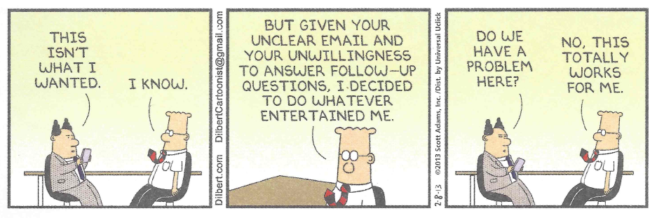

Requirements
============

Requirements are what the software must do.

Specifically: a requirement is a singular need which must be satisfied for the system to work correctly, e.g., an ATM must allow a customer to withdraw money from his/her account.

Issues:

-   gathering requirements: requires interacting with the customer

    -   customers aren't always that great at telling you what they want
	-	customers aren't always that great at recognizing what they NEED
    -   sometimes if you build exactly what they want(ed), they'll realize they want something different
	-	sometimes only after you build exactly what they asked for, will they realize what else it is they want
	
> 	

-   documenting requirements, AKA capturing requirements: **how do we do this?**
		
	-   making sure requirements are satisfied
    -   need to make sure that requirements have been addressed: **how do we do that - guarantee that every requirement has been met?**
    -   in a large system, with many requirements, this requires a great deal of attention to detail
	
So, let's have some "fun", and try to capture some requirements from a customer with a "simple" idea for a consumer product.

**I'll be the voice of the customer (VOC) and tell you what I (think) I want, and it's your job to figure out what it is that I will really want/need/require.**
