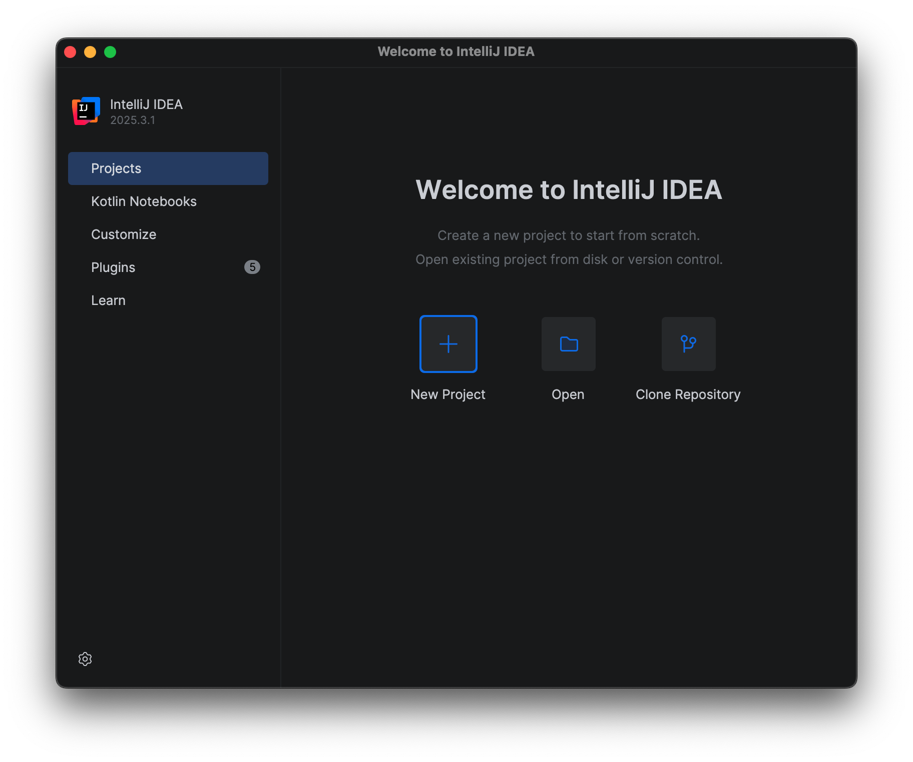
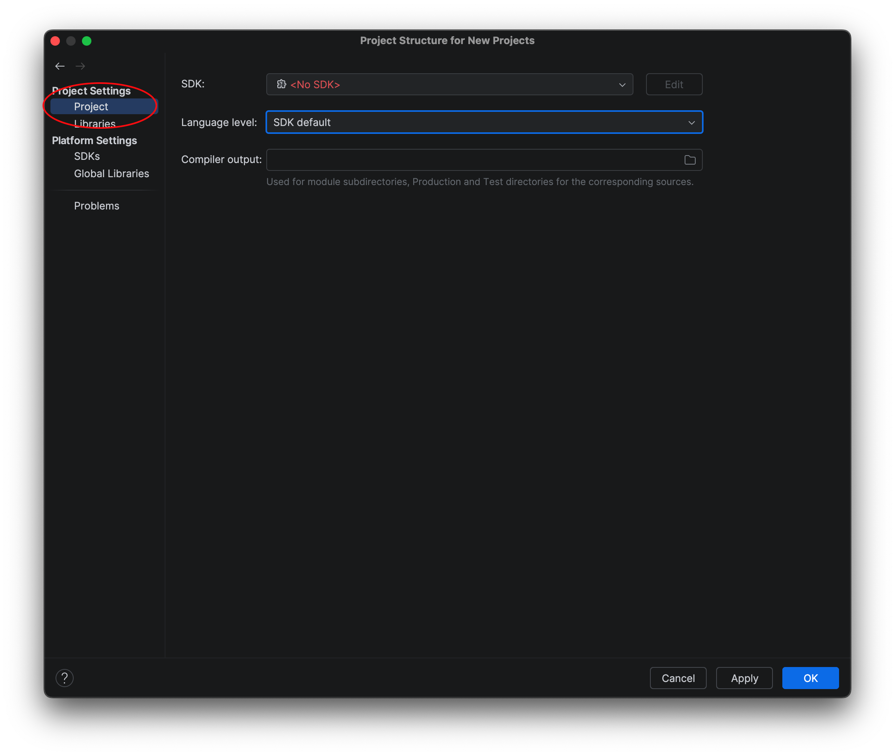
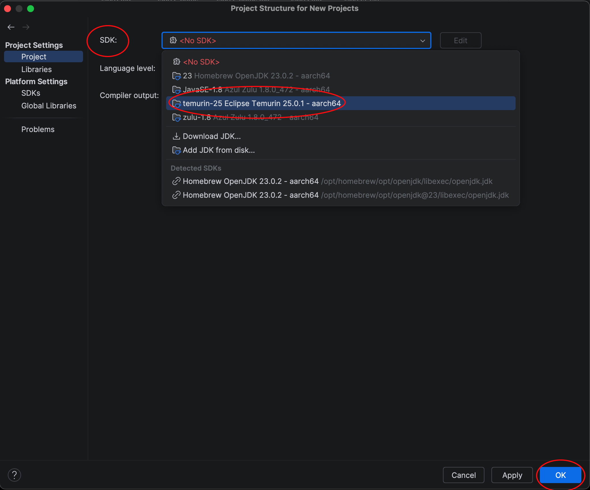

This page links to useful resources.

Java 23
=======

**BE SURE TO INSTALL JAVA FIRST.** We will be using Java 25 for this course. Follow the instructions below to install the [Temurin OpenJDK](https://adoptium.net/temurin/releases/?version=25) open source version of the Java 25 JDK.

IntelliJ
========

We will be using the [IntelliJ](https://www.jetbrains.com/idea/) IDE for this course.

Once you have both Java 25 and IntelliJ installed, start IntelliJ and at the startup screen 

> 

select **File->Project Structure** from the menu bar.

> 

Under **Project Settings**, select **Project** and in the **SDK** dropdown, select the Temurin Java 25 option and click **OK**.

> 

Artificial Intelligence (AI) and ChatGPT
========================================
[ChatGPT](https://chat.openai.com): ChatGPT (andother large language models - LLMs) will be able to give you answers (or at least point you in a generally good direction) for many of the topics listed below.  You should sign up for the free ChatGPT account so that you can keep track of your conversations.

[AI Bill of Rights (2022)](WhiteHouse-AIBillOfRights-Oct2022.pdf)

Hypertext Mark-Up Language (HTML) and Cascading Style Sheets (CSS)
===================================================================

[w3Schools.com](http://www.w3schools.com): **Go here first for HTML/CSS, SQL, JavaScript, PHP tutorials**

[Free Code Camp](https://www.freecodecamp.org): Covers HTML/CSS (you need to create a free account)

[Basic HTML Tutorial](http://www.htmliseasy.com/html_tutor/index.html): Tutorial site for Basic HTML

[HTML Forms Tutprial](http://www.htmliseasy.com/form_tutor/lesson01.html): Tutorial site for creating HTML Forms

[HTML Tables Tutorial](http://www.htmliseasy.com/table_tutor/index.html): Tutorial site for creating HTML tables

[Basic CSS Tutorial](http://www.htmliseasy.com/css_tutor/index.html): Tutorial site for using CSS

[CSS Reference](http://www.htmliseasy.com/wdgcss/index.html): CSS reference guide from Web Design Group

[Bootstrap](http://www.w3schools.com/bootstrap/default.asp): A visual editor for creating web front-ends

[Brackets](http://brackets.io/): A visual editor for working on HTML/CSS

Java Server Pages (JSP) and Java Standard Tag Library (JSTL)
============================================================

[JSP Tutorial](http://www.tutorialspoint.com/jsp/index.htm): Tutorial site for working with JSPs (note that this references Apache Tomcat, but much of it should apply to Eclipse Jetty)

[JSTL Tutorial](http://www.tutorialspoint.com/jsp/jsp_standard_tag_library.htm): Tutorial site for working with JSTL (linked from above site)

[Session Information](http://www.tutorialspoint.com/jsp/jsp_session_tracking.htm): Creating and using session information (linked from above site)

JavaScript (JS)
===============

[JavaScript Tutorial - w3schools](https://www.w3schools.com/js/default.asp): JavaScript tutorial w/sandbox from **w3shools.com**

[JavaScript Tutorial](http://www.htmliseasy.com/javascript/index.html): Basic JavaScript tutorial

[Free Code Camp](https://www.freecodecamp.org): Covers various JavaScript versions (you need to create a free account)

Email address validation
========================

[A Java email validator class using regex (regular expressions)](https://www.mkyong.com/regular-expressions/how-to-validate-email-address-with-regular-expression/)

Drawing Packages for Wireframes, UML Diagrams, and Database Schemas
===================================================================

I recommend using either of the following **free** tools for creating your diagrams for your group's Wireframes, UML Diagrams and Database Schemas.  You may use other drawing tools, but whichever drawing tool you use, you **must be able to export PDF, PNG, or JPG versions of your drawings**, so that you can embed them on your assignment submissions.

[Lucid Chart](https://www.lucidchart.com/)

[Figma](https://www.figma.com/)

[Draw.io online version](https://app.diagrams.net/)

[Draw.io downloadable version)](https://www.drawio.com/)

Git, GitHub, eGit, Git Desktop Clients
======================================

[GitHub Desktop - Desktop CLient for GitHub](https://desktop.github.com/): An alternative to using Intellij's built-in versioning. It works outside of your IDE, but many students/faculty consider it easier to use.

[Git-Tower - Desktop Client for Git](https://www.git-tower.com/windows): An alternative to using Intellij's built-in versioning. It works outside of your IDE, but many students/faculty consider it easier to use.

[Git Branching Demo](https://learngitbranching.js.org/): Great JavaScript-based demo for using branches in Git

[Free Code Camp](https://www.freecodecamp.org): Covers Git and GitHub (you need to create a free account)

[Git Website](https://git-scm.com): Everything you ever wanted to know about Git, but were afraid to ask

[Git eBook: ProGit v2](https://git-scm.com/book/en/v2): Available free in PDF form

[Git Reference Manual](https://git-scm.com/docs): Git command-line reference

[Git Videos](https://git-scm.com/videos): Tutorials on getting started with Git

[Git Downloads](https://git-scm.com/downloads): Git Clients and Tools

[GitHub - Remote Repository Host](https://github.com/): Teams will create their remote repositories on GitHub

Unified Modeling Language (UML)
===============================

[UML Diagrams](http://usna86-techbits.blogspot.de/2012/11/uml-class-diagram-relationships.html): A concise explanation of UML relationships and diagrams

Relational Databases and Structured Query Language (SQL)
========================================================

[SQL Tutorial - w3schools](https://www.w3schools.com/sql/default.asp): **Go here first for SQL tutorials w/sandbox from w3schools.com**

[Free Code Camp](https://www.freecodecamp.org): Covers SQL Databases (you need to creaate a free account)

CS320 Functor Demo
==================

[CS320\_FunctorDemo.zip](CS320\_FunctorDemo.zip): A brief example showing how to make multiple functors to use to sort a sample **String** array list. 

CS320 Lab06 (JDBC) Solution will be posted here shortly after the final submission date for Lab06 (see lab schedule)
==========================

<!-- Commenting out JDBC and Library Example until they're needed

[CS320\_Lab06\_Solution-2026.zip](CS320_Lab06_Solution-2026.zip): A solution for the JDBC lab (Lab06). Please compare your solution to this code, and make any necessary changes in your code, as an exercise to further understand the material.  There are plenty of comments included in the solution to describe what is happening and why it is being done.
-->

CS320 Library Example Project will be posted here shortly after the final submission date for Lab07 (see lab schedule)
=============================

<!--
[CS320\_LibraryExample\_2026.zip](CS320_LibraryExample_2026.zip): project that ties the [Web Applications Lab](../labs/lab04.html) together with the [ORM Lab](../labs/lab07.html).  This application places a web front-end on the SQL transactions from Lab07, as well as provides examples for creating a Derby database from CSV files, how to use session information after login, and how to use JSTL to display a list of complex objects in a JSP.  It has been updated to incorporate a many-to-many (M2M) relationship between **Books** and **Authors**, using a junction table (**booksAuthors**) that cross-references **book_id**'s with **author_id**'s.  It also contains some basic (non-exhaustive) JUnit Tests for testing the Derby database queries.

> 
<b>NOTE:</b> You are free to incorporate any of this code into your team project(s) - as long as you <b>cite the source in your code</b> and refactor the names from the <b>db</b> and <b>web</b> directories to something that pertains to your project.

Before running the project, open up **DerbyDatabase.java** under **src/main/java/edu.ycp.cs320.example/db/persist** and note the default Derby database name and path in the **connect()** method (which is also used in **SQLDemo.java** in the **main()** method). By default the database will be named **library.example.db** and located in the same folder as the **CS320\_LibraryExample\_2026** directory, i.e. **outside** the project directory.

If you choose to change the location, **DO NOT LOCATE YOUR DATABASE WITHIN THE LibraryExample PROJECT.**  You will likely be using the LibraryExample as the basis for your team project, and placing the database within the project will eventually result in *frustrating* **Git** conflicts when you start working as a team from a common **Git** repository. **YOU HAVE BEEN WARNED!**

Run **DerbyDatabase.java** as an application to create the Library database from the **authors.csv**, **books.csv**, and **bookAuthors.csv** files. It might take a few seconds for the application to create the DB - you will see it in the console.  Afterwards, **library.example.db** will show up in the same folder as the **CS320\_LibraryExample\_2026** folder.

To test that the database was created successfully, run **SQLDemo.java** as an application and issue SQL queries to the LibraryExample DB similar to [Lab05](lab05.html).  If this step doesn't work, then you have incorrectly updated the database location/name in the two Java source files from above.

To run the web application, be sure **SQLDemo** is stopped, then run **Main** located in **src/main/java/edu.ycp.cs320.example/web/main** as a Java application to start the web server. Then in a web browser, enter the following URL:

> [http://localhost:8081/example/login](http://localhost:8081/example/login)

There are currently two sets of login credentials hard-coded into the application:

* User name: **student** with PW: **ycp**

* User name: **faculty** with PW: **E&CS**

After you have successfully logged in, the user name will be passed around as part of the Session information, and each subsequent servlet checks for a valid **Session** (a non-null "user" attribute) before responding to the request.  Note that this is **NOT** a secure method for handling credentials, but is used as an example for passing around and checking **Session** information.

**WARNING: You will receive an Academic Integrity Violation, as well as automatically fail the course, if you submit code as part of your Lab07 solution that was taken from any version of the LibraryExample Project that has ever been provided as part of this course.**

<!--
> 
<b>When you implement the persistence layer using Derby for your team project</b>: when specifying the JDBC URL in the code where you connect to the database, you should use an absolute file name for the database name. For example, <code>jdbc:derby:H:/mydatabase.db;create=true</code> (this will create the database as <code>H:/mydatabase.db</code>).  If you use a relative file name, your web application will probably not find the database (because it runs in the <code>war</code> directory rather than the root directory of the project).

-->
